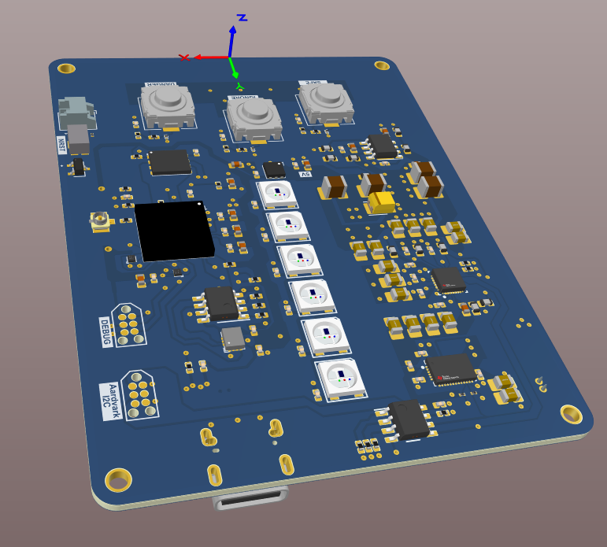
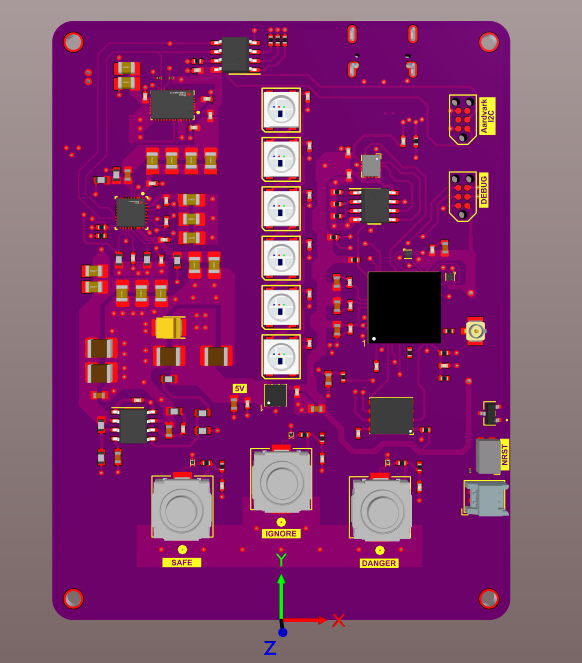
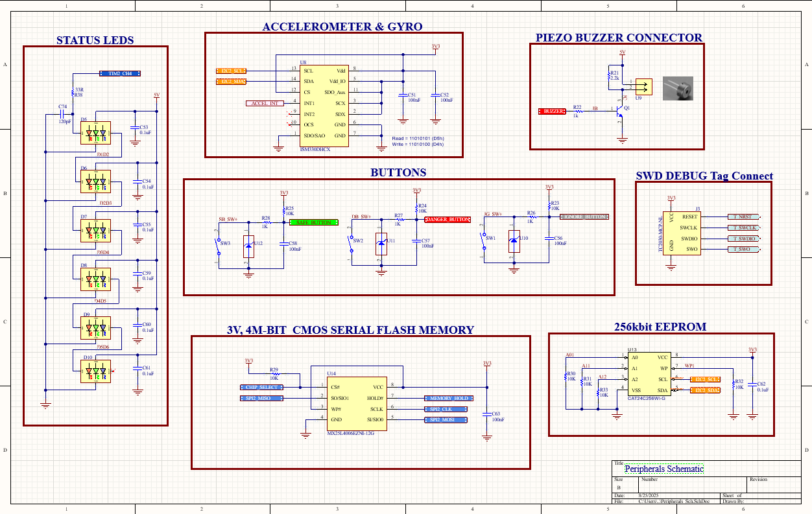
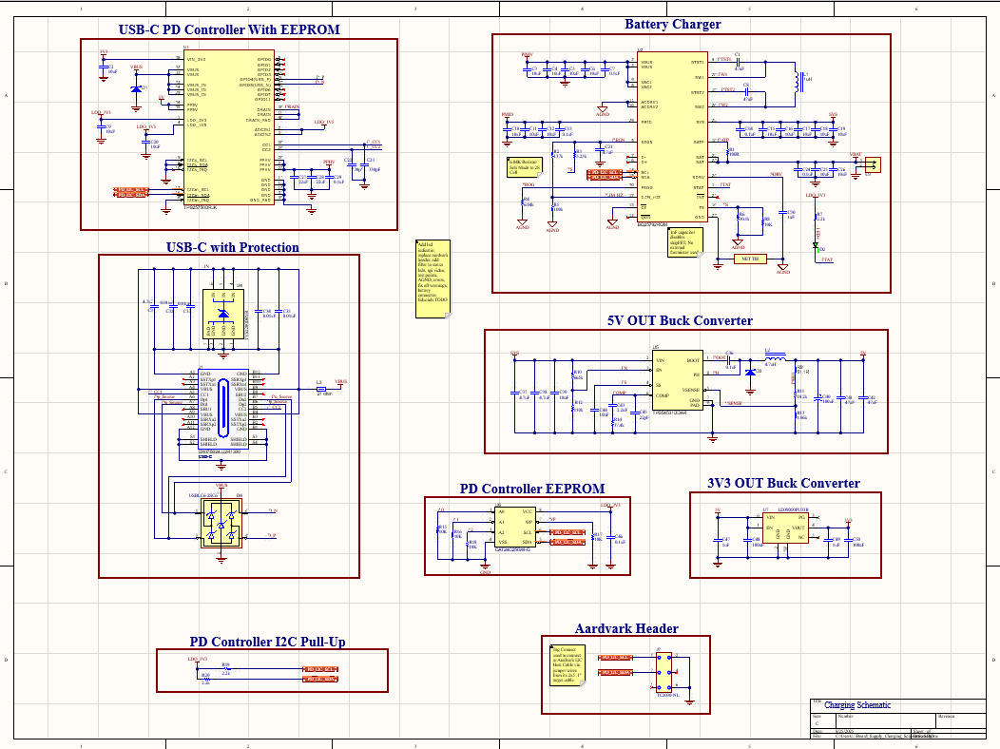
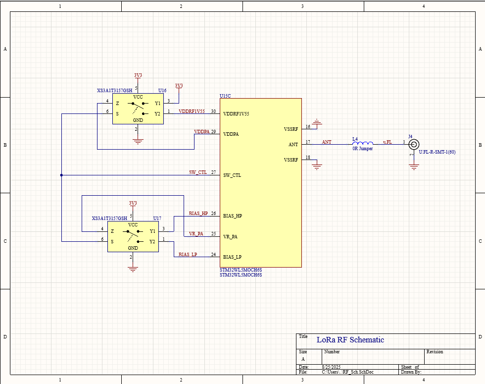
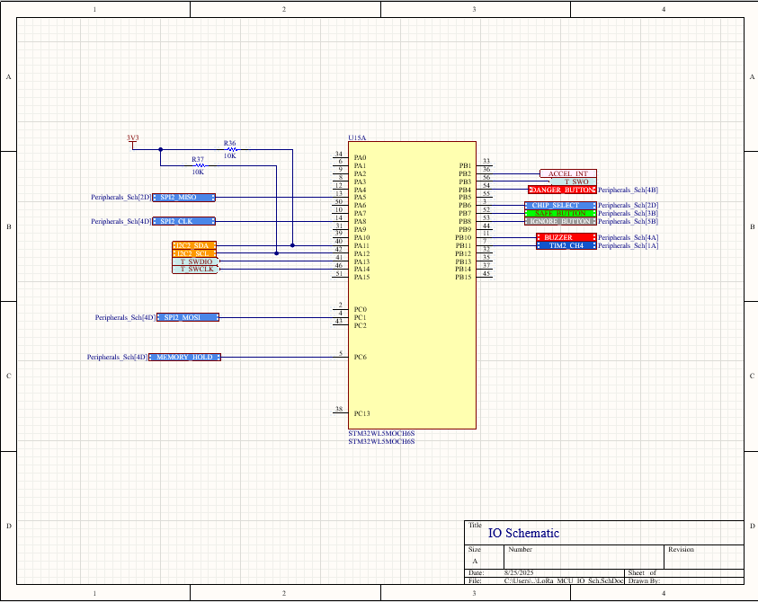

<h1 align="center">RescueNET Snowmobile Safety Device</h1>
  

    Developing a lifesaving PCB that detects when snowmobilers are stuck upside down, which causes suffocation, and sends an emergency alert signal to nearby riders with the GPS coordinates of the victim. The PCB utilizes multiple sensors and an ARM MCU running a Linux-based RTOS to send an emergency signal via LoRa radio or Bluetooth Low-Energy (BLE) in mountainous terrain.
  

<h2 align="center">Isometric View</h2>
  

    
  

<h2 align="center">Top View</h2>
  

    
  

<h2 align="center">Schematics</h2>

### Peripherals
  

    
  

### Board Power Supply
  

    
  

### LoRa RF Schematic
  

    
  

### I/O Schematic
  

    
  
